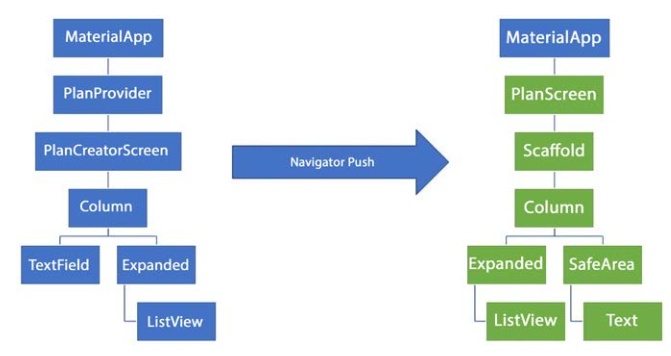

# Praktikum Pemrograman Mobile Minggu 10

> Nama : M. Tryo Bagus Anugerah  
> NIM: 2241720053 
> Kelas : TI-3H  
> Absen : 14  

## Praktikum 1: Dasar State dengan Model-View

> 

## Tugas Praktikum 1: Dasar State dengan Model-View

1. Selesaikan langkah-langkah praktikum tersebut, lalu dokumentasikan berupa GIF hasil akhir praktikum beserta penjelasannya di file README.md! Jika Anda menemukan ada yang error atau tidak berjalan dengan baik, silakan diperbaiki.
2. Jelaskan maksud dari langkah 4 pada praktikum tersebut! Mengapa dilakukan demikian?
    > Jawab : Langkah tersebut dilakukan untuk mempermudah proses pengimporan file plan.dart dan task.dart di file lain, sehingga hanya diperlukan satu perintah impor.
3. Mengapa perlu variabel plan di langkah 6 pada praktikum tersebut? Mengapa dibuat konstanta ?
    > Jawab : Variabel plan digunakan untuk menyimpan instance dari model Plan, yang menggambarkan rencana atau daftar tugas dalam aplikasi. Variabel ini dibuat sebagai konstanta agar nilainya tetap dan tidak dapat diubah setelah didefinisikan.
4. Lakukan capture hasil dari Langkah 9 berupa GIF, kemudian jelaskan apa yang telah Anda buat!
    > 
    > Penjelasan : Akan dikembangkan aplikasi to-do list sederhana yang dapat di-scroll, yang memberikan fitur untuk menambahkan tugas dan menandai tugas yang telah diselesaikan.
5. Apa kegunaan method pada Langkah 11 dan 13 dalam lifecyle state ?
    > Jawab : Metode `initState()` berfungsi untuk menginisialisasi objek state sebelum widget dibangun. Di sisi lain, metode `dispose()` dipanggil ketika objek state dihapus dari widget tree, contohnya saat widget dihapus dari tampilan atau ketika widget induknya dihapus.
6. Kumpulkan laporan praktikum Anda berupa link commit atau repository GitHub ke dosen yang telah disepakati !

## Praktikum 2: Mengelola Data Layer dengan InheritedWidget dan InheritedNotifier

> 

## Tugas Praktikum 2: InheritedWidget

1. Selesaikan langkah-langkah praktikum tersebut, lalu dokumentasikan berupa GIF hasil akhir praktikum beserta penjelasannya di file README.md! Jika Anda menemukan ada yang error atau tidak berjalan dengan baik, silakan diperbaiki sesuai dengan tujuan aplikasi tersebut dibuat.
2. Jelaskan mana yang dimaksud InheritedWidget pada langkah 1 tersebut! Mengapa yang digunakan InheritedNotifier?
    > Jawab : Pada langkah 1, `PlanProvider` adalah kelas yang diturunkan dari `InheritedNotifier<ValueNotifier>`. `InheritedWidget` berfungsi untuk memudahkan widget-widget di bawahnya dalam mengakses data atau mendeteksi perubahan tanpa harus menerima data tersebut secara eksplisit sebagai parameter. Dengan mengintegrasikan `InheritedNotifier`, `PlanProvider` memungkinkan data yang diteruskan untuk secara otomatis memicu pembaruan pada widget yang bergantung padanya ketika terjadi perubahan data, sehingga aplikasi dapat tetap sinkron dengan efisien.
3. Jelaskan maksud dari method di langkah 3 pada praktikum tersebut! Mengapa dilakukan demikian?
    > Jawab : Metode `completedCount()` dalam kelas `Plan` berfungsi untuk menghitung jumlah tugas yang telah diselesaikan. Sementara itu, metode `completenessMessage()` menghasilkan pesan yang memberikan informasi mengenai progres penyelesaian tugas, dengan menampilkan jumlah tugas yang telah selesai dibandingkan dengan total tugas yang ada. Kedua metode ini membantu memberikan gambaran yang jelas tentang kemajuan rencana pengguna.
4. Lakukan capture hasil dari Langkah 9 berupa GIF, kemudian jelaskan apa yang telah Anda buat!
    > 
    > Penjelasan : Pada praktikum ini, kita akan membuat footer yang menampilkan jumlah tugas yang telah diselesaikan oleh pengguna, menggunakan metode `completedCount()` dari kelas `Plan`. Footer ini juga akan menampilkan pesan progres dengan membandingkan jumlah tugas yang selesai dengan total tugas yang ada.
5. Kumpulkan laporan praktikum Anda berupa link commit atau repository GitHub ke dosen yang telah disepakati !

## Praktikum 3: Membuat State di Multiple Screens

> 

## Tugas Praktikum 3: State di Multiple Screens

1. Selesaikan langkah-langkah praktikum tersebut, lalu dokumentasikan berupa GIF hasil akhir praktikum beserta penjelasannya di file README.md! Jika Anda menemukan ada yang error atau tidak berjalan dengan baik, silakan diperbaiki sesuai dengan tujuan aplikasi tersebut dibuat.
2. Berdasarkan Praktikum 3 yang telah Anda lakukan, jelaskan maksud dari gambar diagram berikut ini! 
    > Jawab: Diagram ini menunjukkan proses navigasi dalam aplikasi Flutter menggunakan `Navigator.push` untuk berpindah dari satu tampilan ke tampilan lain. Di sisi kiri, tampilan awal adalah `PlanCreatorScreen`, yang berisi `TextField` dan `ListView` di dalam sebuah Column. Ketika `Navigator.push` digunakan, aplikasi akan berpindah ke tampilan baru di sisi kanan, yaitu `PlanScreen`. Pada `PlanScreen`, ada tambahan komponen seperti `Scaffold`, `SafeArea`, dan `Text`, yang membantu membentuk struktur tata letak yang lebih lengkap. `Scaffold` menyediakan kerangka dasar untuk UI, sedangkan `SafeArea` memastikan bahwa konten tidak terhalang oleh area layar yang sensitif, seperti notch atau status bar.
3. Lakukan capture hasil dari Langkah 14 berupa GIF, kemudian jelaskan apa yang telah Anda buat!
    > 
    > Penjelasan : Akan mengembangkan aplikasi yang lebih kompleks, di mana setiap kali membuat plan, akan ada serangkaian task yang perlu diselesaikan terlebih dahulu. Selain itu, pengguna juga dapat menambahkan lebih dari satu plan.
4. Kumpulkan laporan praktikum Anda berupa link commit atau repository GitHub ke dosen yang telah disepakati !
