# Praktikum Pemrograman Mobile Minggu 11 | Pemrograman Asynchronous

> Nama : M. Tryo Bagus Anugerah  
> NIM: 2241720053 
> Kelas : TI-3H  
> Absen : 14  

## Praktikum 1: Mengunduh Data dari Web Service (API)

### Soal 1

> 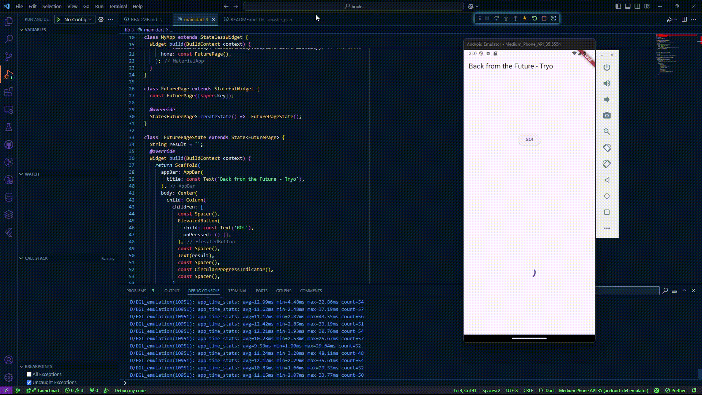

### Soal 2

> 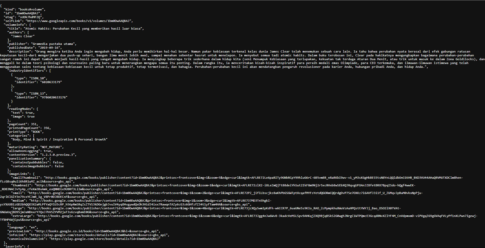

### Soal 3

> 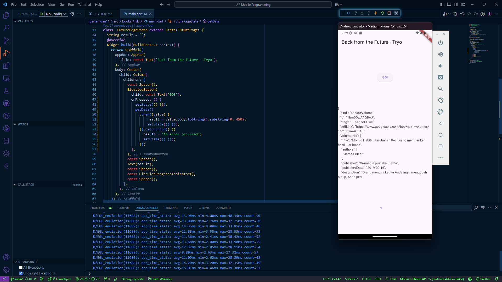

- Jelaskan maksud kode langkah 5 tersebut terkait `substring` dan `catchError`!
    > - `Substring` berguna membatasi panjang string hingga 450 karakter pertama untuk mencegah data terlalu panjang. 
    > - `CatchError` berguna menangkap error dari proses asinkron agar aplikasi tetap berjalan dengan memberikan pesan error yang sesuai.

## Praktikum 2: Menggunakan await/async untuk menghindari callbacks

### Soal 4

> 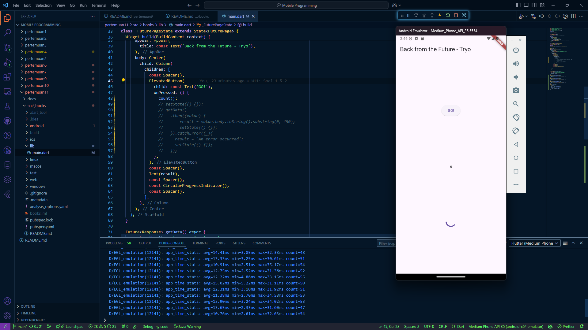

- Jelaskan maksud kode langkah 1 dan 2 tersebut!
    > - **Langkah 1** mendefinisikan fungsi asinkron untuk menghasilkan nilai integer setelah simulasi delay selama 3 detik.
    > - **Langkah 2** menghitung total secara berurutan dari ketiga fungsi asinkron, lalu memperbarui UI dengan hasil akhir.

## Praktikum 3: Menggunakan Completer di Future

### Soal 5

> 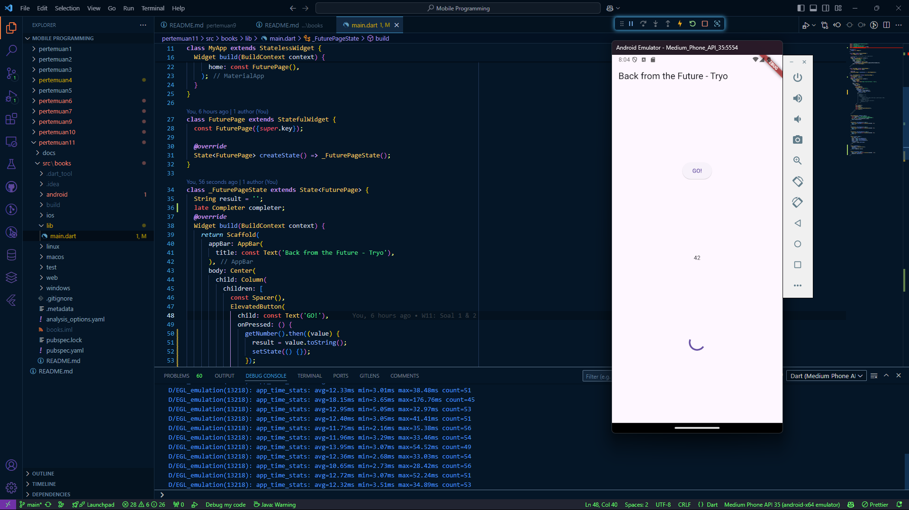

- Jelaskan maksud kode langkah 2 tersebut!
    > - Pada langkah 2 menambahkan kode yang menggunakan `Completer` untuk mengontrol penyelesaian sebuah `Future` secara manual. Fungsi `getNumber()` mengembalikan sebuah `Future`, yang diselesaikan oleh fungsi `calculate()` setelah 5 detik dengan nilai `42`.

### Soal 6

> 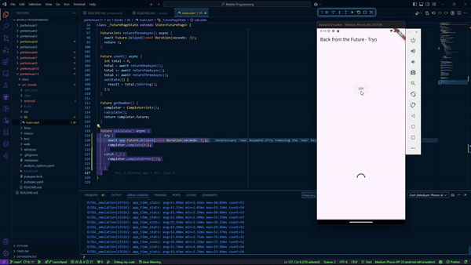

- Jelaskan maksud perbedaan kode langkah 2 dengan langkah 5-6 tersebut!
    > - **Langkah 2** hanya menangani keberhasilan tanpa memperhatikan kemungkinan error, sehingga tidak robust. **Langkah 5-6** menambahkan penanganan error dengan blok `try-catch` dan `.catchError`, sehingga lebih tangguh dan dapat memberikan umpan balik ke UI untuk kasus sukses maupun error.

## Praktikum 4: Memanggil Future secara paralel

### Soal 7

> 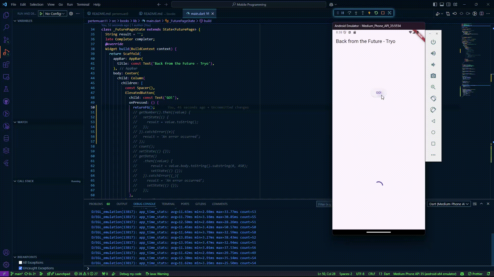

### Soal 8

- Jelaskan maksud perbedaan kode langkah 1 dan 4!
    > - Langkah 1 (FutureGroup) Memberikan kontrol lebih besar atas `Future` yang ditambahkan, karena dapat menambahkan `Future` secara dinamis sebelum memanggil `close()`.
    > - Langkah 4 (Future.wait) Pendekatan yang lebih sederhana dan langsung untuk menjalankan kumpulan `Future` secara bersamaan.

## Praktikum 5: Menangani Respon Error pada Async Code

### Soal 9

> 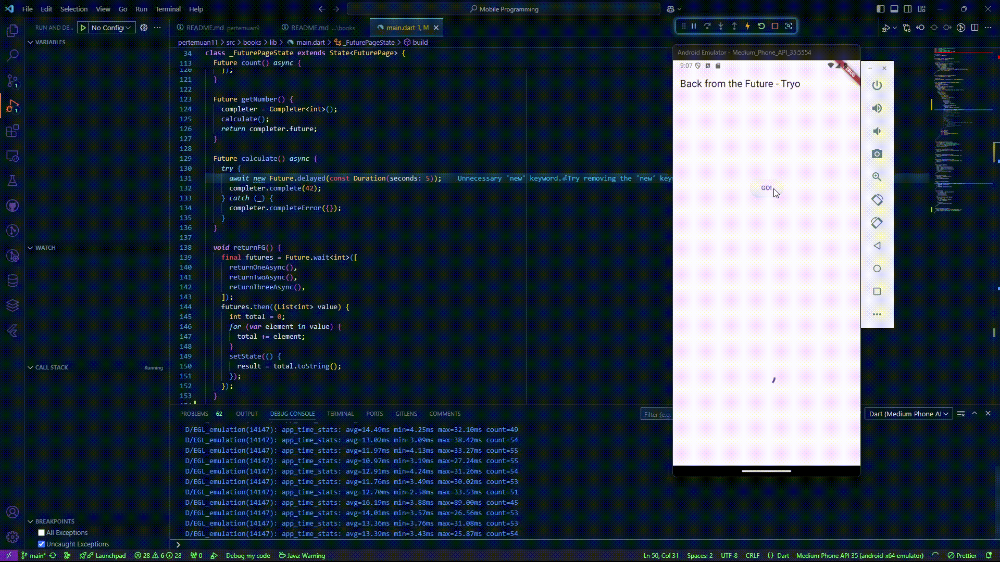

### Soal 10

> 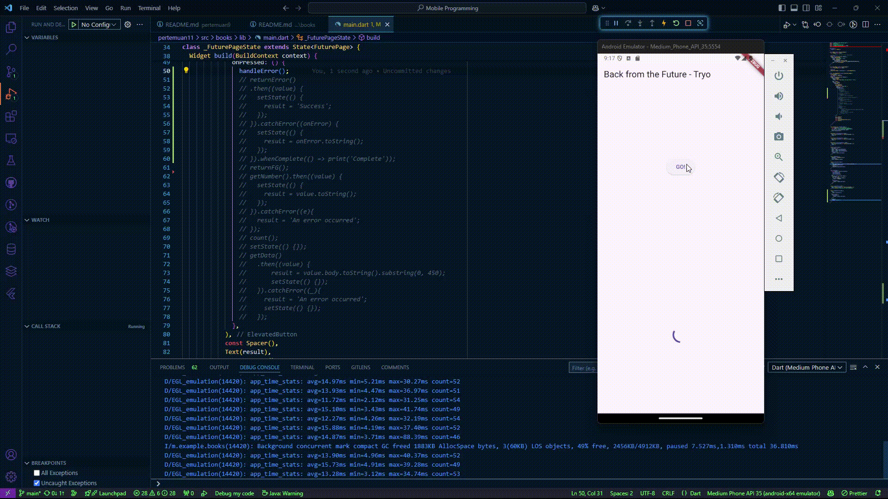

- Panggil method `handleError()` tersebut di `ElevatedButton`, lalu run. Apa hasilnya? Jelaskan perbedaan kode langkah 1 dan 4!
    > - Pada langkah 1 (`returnError`) Fungsi ini hanya mensimulasikan sebuah operasi asinkron yang menghasilkan error. Setelah menunggu 2 detik menggunakan `Future.delayed`, fungsi ini langsung melemparkan `exception` dengan pesan `'Something terrible happened'`.
    > - Pada langkah 4 (`handleError`) Fungsi ini menangani error yang dilempar oleh `returnError` menggunakan `try-catch-finally`. Jika error terjadi, blok `catch` dipanggil untuk memperbarui UI (dengan mengatur nilai `result` ke pesan error). Blok `finally` memastikan bahwa pernyataan `print('Complete')` akan dijalankan, baik ada error maupun tidak.

## Praktikum 6: Menggunakan Future dengan StatefulWidget

### Soal 11

Tambahkan nama panggilan Anda pada tiap properti `title` sebagai identitas pekerjaan Anda.

> 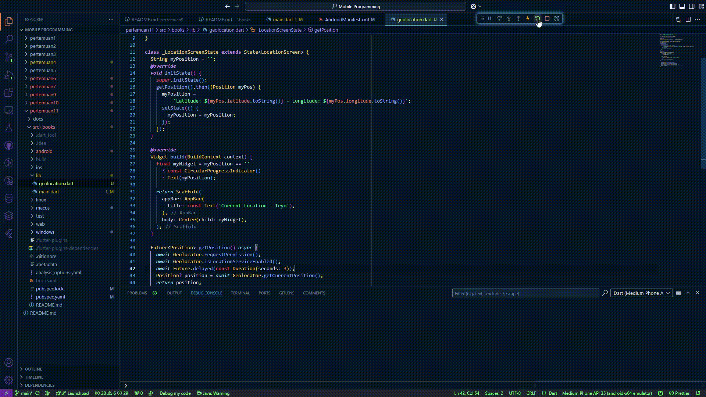

### Soal 12

> 

- Jika Anda tidak melihat animasi loading tampil, kemungkinan itu berjalan sangat cepat. Tambahkan delay pada method `getPosition()` dengan kode `await Future.delayed(const Duration(seconds: 3));`
- Apakah Anda mendapatkan koordinat GPS ketika run di browser? Mengapa demikian?
    > Ya, Pada hasil yang saya jalankan di browser bisa menghasilkan koordinat GPS karena pada laptop yang saya gunakan terdapat GPS untuk dijalankan pada browser 

Hasil Pada Browser :
> 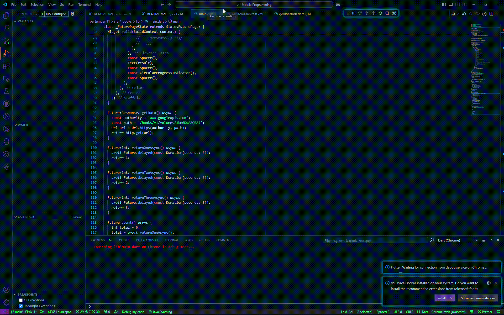

## Praktikum 7: Manajemen Future dengan FutureBuilder

### Soal 13

> 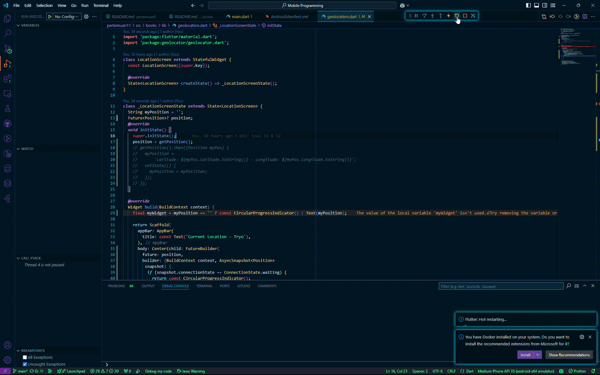

- Apakah ada perbedaan UI dengan praktikum sebelumnya? Mengapa demikian?
    > - Tidak ada perbedaan UI dari praktikum sebelumnya karena pada praktikum ini hanya mengganti menggunakan `FutureBuilder`.

### Soal 14

> 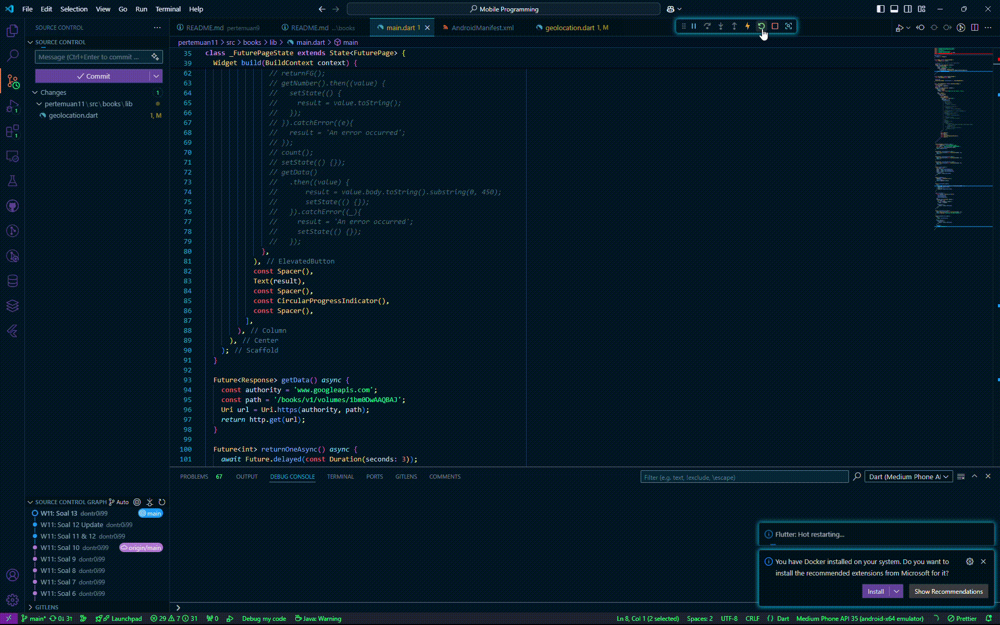

- Apakah ada perbedaan UI dengan praktikum sebelumnya? Mengapa demikian?
    > - Tidak ada perbedaan UI dari langkah sebelumnya karena pada langkah ini hanya menambahkan error handling.

