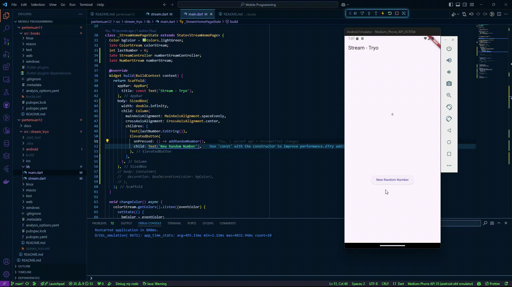
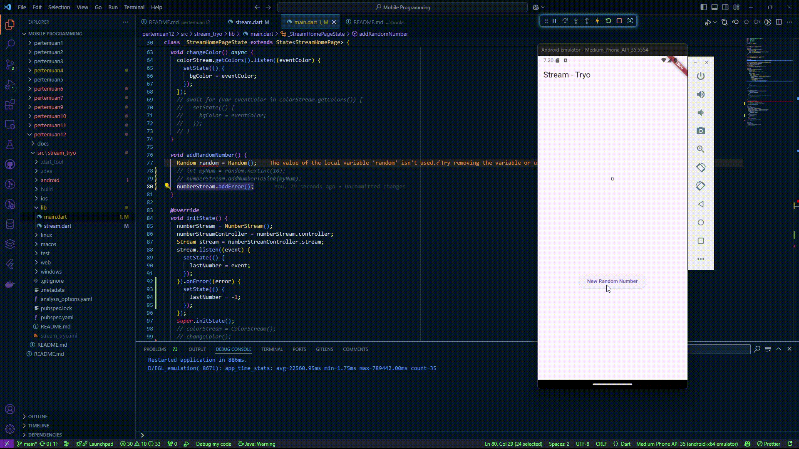
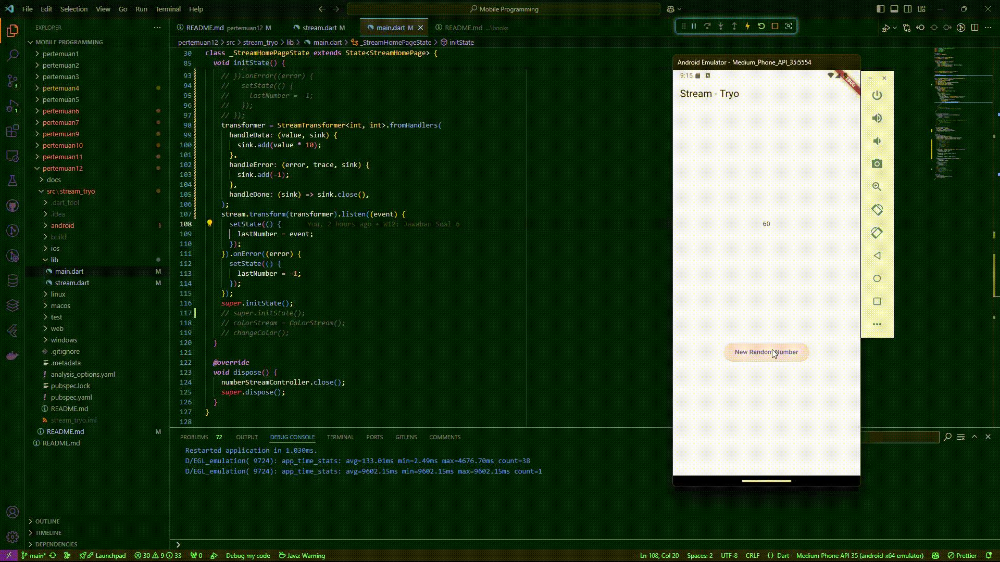
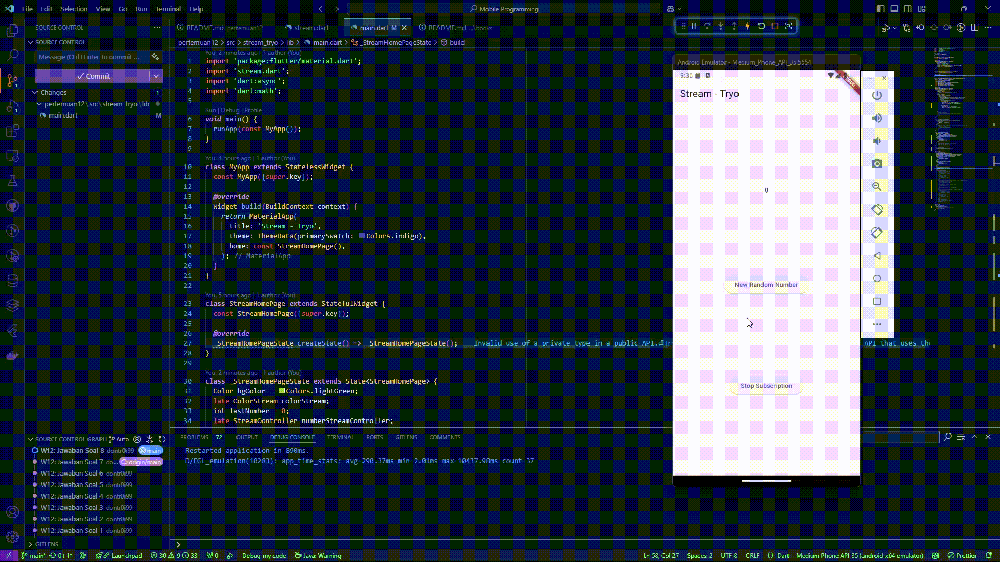

# Praktikum Pemrograman Mobile Minggu 12 | Lanjutan State Management dengan Streams

> Nama : M. Tryo Bagus Anugerah <br />
> NIM: 2241720053<br />
> Kelas : TI-3H <br />
> Absen : 14 <br />
<hr>

## Praktikum 1: Dart Streams

### Soal 1

> 

### Soal 2

> 

### Soal 3

```dart
yield* Stream.periodic(
      const Duration(seconds: 1), (int t) {
        int index = t % colors.length;
        return colors[index];
    });
```

- Jelaskan fungsi keyword yield* pada kode tersebut!
    > - Keyword `yield*` Digunakan untuk menghasilkan semua elemen dari stream atau iterable lain. Dalam kasus ini, `yield*` mengalirkan elemen yang dihasilkan oleh `Stream.periodic`.
- Apa maksud isi perintah kode tersebut?
    > - `Stream.periodic` menghasilkan elemen secara periodik setiap 1 detik.<br>
    > - Fungsi `(int t)` menghitung indeks warna dengan `t % colors.length` sehingga warna dari daftar `colors` dipilih secara bergantian.<br>
    > - Hasilnya adalah stream yang memancarkan warna dari `colors` secara berulang setiap detik.

### Soal 4

> 

### Soal 5

> <br>

- Jelaskan perbedaan menggunakan `listen` dan `await for` (langkah 9) !
    > - `listen` digunakan untuk mendengarkan stream secara asinkron dengan callback yang dipanggil setiap kali data baru diterima. Penggunaan `listen` tidak memblokir eksekusi kode setelahnya, memungkinkan aplikasi untuk terus berjalan. Ini sangat cocok untuk menangani stream yang bersifat broadcast atau ketika berbagai event perlu diproses secara reaktif, seperti data baru, error, atau selesai.<br>

    > - `await for` digunakan untuk secara berurutan mengambil data dari stream dalam bentuk loop asinkron. Penggunaan `await for` akan memblokir eksekusi kode di dalam scope hingga stream selesai, dan cocok digunakan untuk stream yang hanya memiliki satu subscriber. Struktur ini memungkinkan pemrosesan data dalam urutan yang diterima secara linier.

## Praktikum 2: Stream controllers dan sinks

### Soal 6

> <br>

- Jelaskan maksud kode langkah 8 dan 10 tersebut!
    > - Fungsi `addRandomNumber()` menghasilkan angka acak antara 0-9 dan mengirimkannya ke stream `numberStream` menggunakan `addNumberToSink()`. Di dalam `initState()`, objek `numberStream` diinisialisasi dan stream yang ada pada `numberStreamController` didengarkan. Setiap kali ada data baru, nilai `lastNumber` diperbarui dengan memanggil `setState()` agar tampilan UI diperbarui. Pada metode `dispose()`, `numberStreamController` ditutup untuk mencegah kebocoran memori ketika widget dihapus.

### Soal 7

> <br>

- Jelaskan maksud kode langkah 13 sampai 15 tersebut!
    > - Fungsi `addError()` menambahkan error ke stream, yang kemudian ditangani oleh `stream.listen()`. Ketika terjadi error, callback `.onError()` akan mengubah nilai `lastNumber` menjadi `-1`. Panggilan `numberStream.addError()` memicu error dalam stream yang ditangani oleh listener.

## Praktikum 3: Injeksi data ke streams

### Soal 8

> <br>

- Jelaskan maksud kode langkah 1-3 tersebut!
    > - Kode tersebut membuat `StreamTransformer` untuk memodifikasi data yang diterima dari stream. Setiap nilai yang diterima akan dikalikan dengan 10, sedangkan error akan menghasilkan nilai `-1`. Transformer diterapkan pada stream, dan hasilnya didengarkan untuk memperbarui `lastNumber`. Jika terjadi error, `lastNumber` akan diubah menjadi `-1`.

## Praktikum 4: Subscribe ke stream events

### Soal 9

> <br>

- Jelaskan maksud kode langkah 2, 6 dan 8 tersebut!
    > - Kode tersebut mendengarkan stream untuk memperbarui nilai `lastNumber` setiap kali data baru diterima. Jika terjadi error, nilai `lastNumber` diubah menjadi `-1`, dan ketika stream selesai, mencetak pesan 'onDone was called'. Pada metode `dispose()`, langganan stream dibatalkan dengan `subscription.cancel()` untuk mencegah kebocoran memori. Fungsi `addRandomNumber()` menghasilkan angka acak dan menambahkannya ke stream jika stream masih terbuka. Jika stream sudah ditutup, nilai `lastNumber` akan diubah menjadi `-1`.