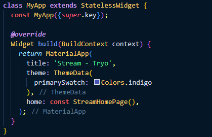
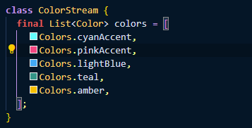
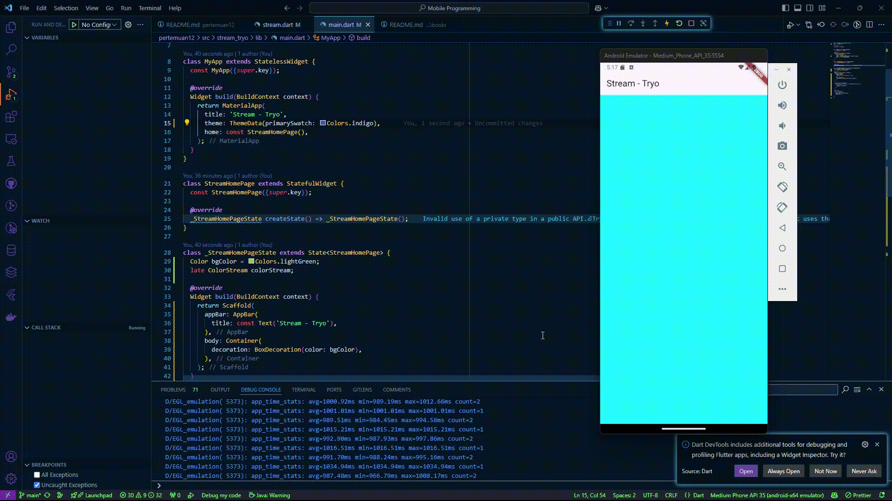
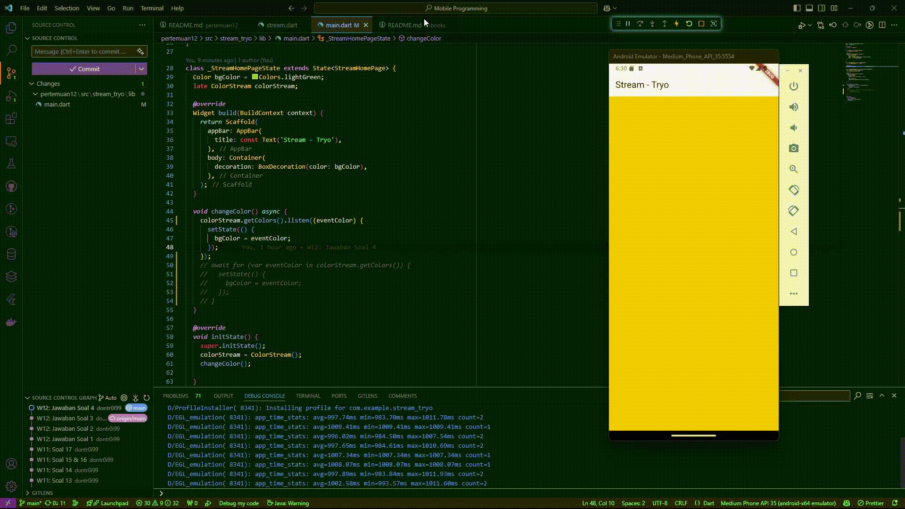

# Praktikum Pemrograman Mobile Minggu 12 | Lanjutan State Management dengan Streams

> Nama : M. Tryo Bagus Anugerah <br />
> NIM: 2241720053<br />
> Kelas : TI-3H <br />
> Absen : 14 <br />
<hr>

## Praktikum 1: Dart Streams

### Soal 1

> 

### Soal 2

> 

### Soal 3

```dart
yield* Stream.periodic(
      const Duration(seconds: 1), (int t) {
        int index = t % colors.length;
        return colors[index];
    });
```

- Jelaskan fungsi keyword yield* pada kode tersebut!
    > - Keyword `yield*` Digunakan untuk menghasilkan semua elemen dari stream atau iterable lain. Dalam kasus ini, `yield*` mengalirkan elemen yang dihasilkan oleh `Stream.periodic`.
- Apa maksud isi perintah kode tersebut?
    > - `Stream.periodic` menghasilkan elemen secara periodik setiap 1 detik.<br>
    > - Fungsi `(int t)` menghitung indeks warna dengan `t % colors.length` sehingga warna dari daftar `colors` dipilih secara bergantian.<br>
    > - Hasilnya adalah stream yang memancarkan warna dari `colors` secara berulang setiap detik.

### Soal 4

> 

### Soal 5

> 

- Jelaskan perbedaan menggunakan `listen` dan `await for` !
    > - listen digunakan untuk mendengarkan stream secara asinkron dengan callback yang dipanggil setiap kali data baru diterima. Penggunaan listen tidak memblokir eksekusi kode setelahnya, memungkinkan aplikasi untuk terus berjalan. Ini sangat cocok untuk menangani stream yang bersifat broadcast atau ketika berbagai event perlu diproses secara reaktif, seperti data baru, error, atau selesai.<br>

    > - await for digunakan untuk secara berurutan mengambil data dari stream dalam bentuk loop asinkron. Penggunaan await for akan memblokir eksekusi kode di dalam scope hingga stream selesai, dan cocok digunakan untuk stream yang hanya memiliki satu subscriber. Struktur ini memungkinkan pemrosesan data dalam urutan yang diterima secara linier.