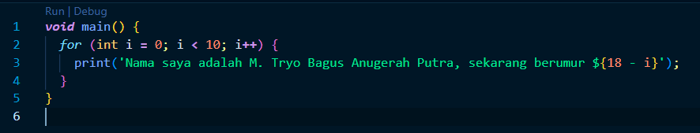
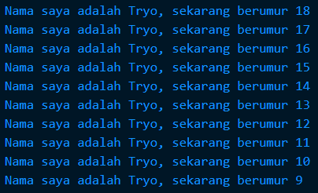

## Praktikum Pemrograman Mobile Minggu 2

> Nama : M. Tryo Bagus Anugerah <br />
> NIM: 2241720053<br />
> Kelas : TI-3H <br />
> Absen : 14 <br />

### Soal 1

Modifikasilah kode pada baris 3 di VS Code atau Editor Code favorit Anda berikut ini agar mendapatkan keluaran (output) sesuai yang diminta!

```dart

void main() {
    for (int i = 0; i < 10; i ++) {
        print('hello ${i + 2}');
    }
}
``` 

Output yang diminta:

```bash
Nama saya adalah Fulan, sekarang berumur 18
Nama saya adalah Fulan, sekarang berumur 17
Nama saya adalah Fulan, sekarang berumur 16
Nama saya adalah Fulan, sekarang berumur 15
Nama saya adalah Fulan, sekarang berumur 14
Nama saya adalah Fulan, sekarang berumur 13
Nama saya adalah Fulan, sekarang berumur 12
Nama saya adalah Fulan, sekarang berumur 11
Nama saya adalah Fulan, sekarang berumur 10
Nama saya adalah Fulan, sekarang berumur 9
```

`Jawab :`



`Output :`




### Soal 2

Mengapa sangat penting untuk memahami bahasa pemrograman Dart sebelum kita menggunakan framework Flutter ? Jelaskan!

`Jawab :` Memahami Dart penting sebelum menggunakan Flutter karena Flutter sepenuhnya dibangun di atas Dart, sehingga memahami sintaks dan konsep Dart seperti pemrograman asinkron dan null safety mempermudah pengembangan aplikasi. Selain itu, pemahaman Dart memungkinkan optimisasi kinerja dan pembuatan widget kustom yang efisien di Flutter.


### Soal 3

Rangkumlah materi dari codelab ini menjadi poin-poin penting yang dapat Anda gunakan untuk membantu proses pengembangan aplikasi mobile menggunakan framework Flutter.

`Jawab :`<br>
Dari materi pada codelab pertemuan 2, berikut adalah rangkuman yang telah saya buat.

1. Keunggulan Dart:
   - `Productive tooling` Dart menyediakan berbagai alat seperti analisis kode, plugin IDE, dan ekosistem paket yang kaya, memudahkan pengembangan.
   - `Garbage collection` Dart secara otomatis membersihkan memori yang tidak lagi digunakan, sehingga tidak perlu repot menghapusnya sendiri.
   - `Type annotations (opsional)` Meskipun opsional, fitur ini membantu menjaga keamanan dan konsistensi data.
   - `Statically typed` Dart tetap aman karena mampu mendeteksi tipe data dan bug saat kompilasi, meskipun pengetikan tipe bersifat opsional.
   - `Portabilitas` Dart tidak hanya untuk web (dengan JavaScript) tapi juga bisa dikompilasi langsung untuk ARM dan x86.

2. Evolusi Dart:
   - Dart lahir tahun 2011, awalnya untuk web sebagai pengganti JavaScript, namun kini fokus utamanya pada pengembangan aplikasi mobile dengan Flutter.
   - Dart mengatasi kelemahan JavaScript dan menawarkan performa tinggi serta alat modern yang cocok untuk proyek besar.
   - Fleksibel dan tangguh, Dart tetap mendukung type annotations yang opsional sambil mengadopsi prinsip-prinsip OOP.

3. Cara Kerja Dart:
   - `Dart VM` Kode Dart bisa dikompilasi secara Just-In-Time (JIT), sangat membantu saat pengembangan karena mendukung debugging dan hot reload.
   - `Kompilasi Ahead-Of-Time (AOT)` Kode juga bisa dikompilasi sebelumnya untuk performa lebih cepat, meski fitur debugging tidak bisa digunakan.
   - `Hot reload` Fitur ini membuat perubahan kode terlihat langsung tanpa perlu restart aplikasi, mempercepat pengembangan secara signifikan.

4. Struktur Bahasa Dart:
   - Dart mendukung Object-Oriented Programming (OOP), dengan konsep seperti `encapsulation`, `inheritance`, dan `polymorphism`, jadi jika sudah terbiasa dengan OOP, Dart akan terasa familiar.
   - Dart mendukung operator dasar `+, -, *, /` yang dapat digunakan untuk berbagai tipe data dan situasi, dengan fleksibilitas tinggi, seperti bahasa pemrograman lainnya.
   - `Type safety`, Operator `==` di Dart membandingkan nilai, bukan alamat memori, sehingga memastikan kode lebih aman.
   - `Logical operators`, seperti bahasa pemrograman lainnya Dart juga bisa menggunakan operator logika seperti `!, ||,` dan `&&` untuk menggabungkan ekspresi kondisi dengan mudah.

5. Penggunaan Operator:
   - Untuk operasi dasar, Dart mendukung penjumlahan `(+)`, pengurangan `(-)`, perkalian `(*)`, pembagian `(/)`, dan modulus `(%)`.
   - Pada Dart juga bisa menambah atau mengurangi nilai variabel dengan `++` dan `--`.
   - Operator perbandingan seperti `==` dan `!=` membantu memeriksa kesamaan atau perbedaan, sementara `>` dan `<` digunakan untuk perbandingan lainnya.
