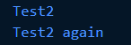
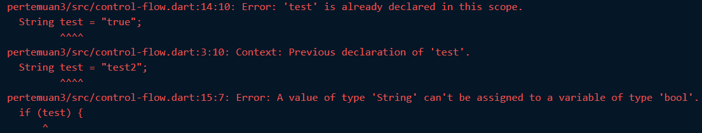
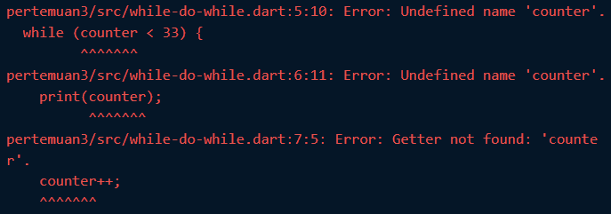
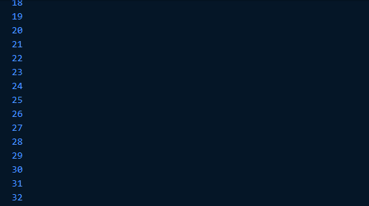
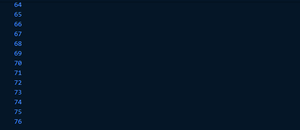
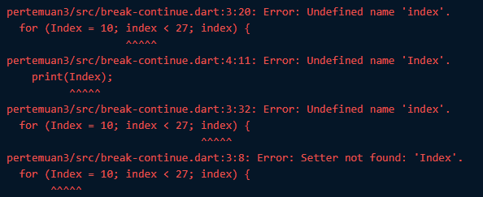
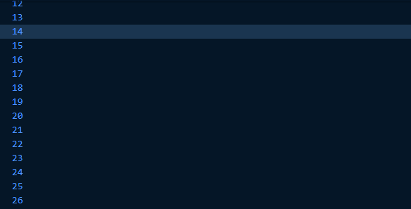
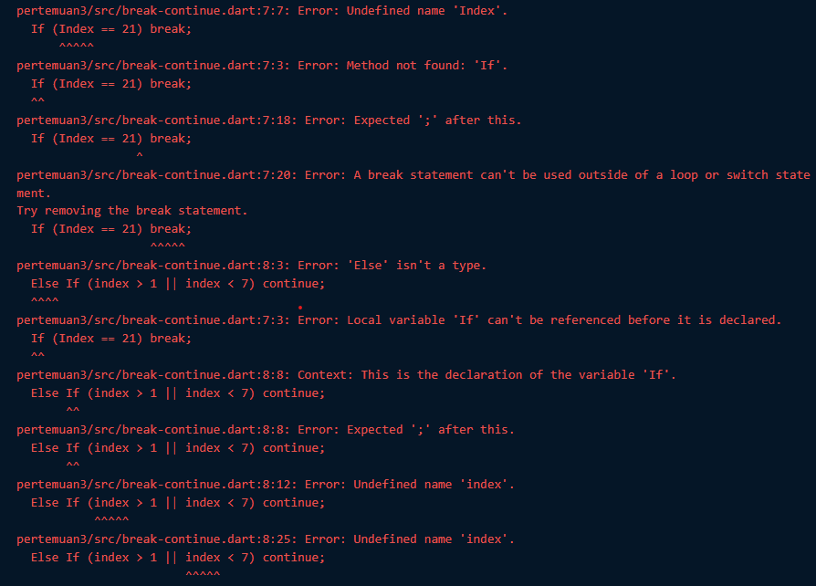
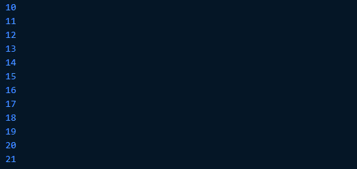
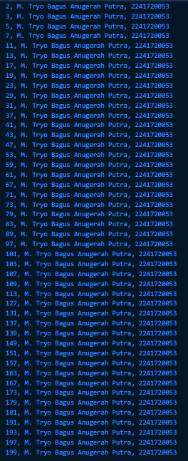

## Praktikum Pemrograman Mobile Minggu 3

> Nama : M. Tryo Bagus Anugerah <br />
> NIM: 2241720053<br />
> Kelas : TI-3H <br />
> Absen : 14 <br />

### Praktikum 1: Menerapkan Control Flows

#### Langkah 1:
Ketik atau salin kode program berikut ke dalam fungsi `main()`.

```dart
String test = "test2";
if (test == "test1") {
print("Test1");
} else If (test == "test2") {
print("Test2");
} Else {
print("Something else");
}

if (test == "test2") print("Test2 again");
```

Hasil Praktikum:

```dart
String test = "test2";
if (test == "test1") {
print("Test1");
} else if (test == "test2") {
print("Test2");
} else {
print("Something else");
}

if (test == "test2") print("Test2 again");
```

#### Langkah 2: Silakan coba eksekusi (Run) kode pada langkah 1 tersebut. Apa yang terjadi? Jelaskan!

Output :

> 

Output dari program menampilkan hasil seperti diatas. Pada awal kode mendeklarasi variable `test` dengan value `"test2"`, kemudian terdapat kondisi yang mengecek apakah variable `test` bernilai `"test1"` dan hasilnya salah, maka akan dilanjutkan ke kondisi kedua yang mengecek apakah variable `test` memiliki nilai `"test2"`, dan hasilnya benar maka program akan menampilkan output `"Test2"`. Kemudian terdapat kondisi yang dituliskan dengan model inline yang mengecek apakah variable `test` memiliki value `"test2"`, karena kondisi tersebut terpenuhi maka program akan menampilkan output `Test2 again`.

#### Langkah 3:
Tambahkan kode program berikut, lalu coba eksekusi (Run) kode Anda.

```dart
String test = "true";
if (test) {
   print("Kebenaran");
}
```

Apa yang terjadi ? Jika terjadi error, silakan perbaiki namun tetap menggunakan if/else.

Hasil perbaikan:
```dart
test = "true";
if (test == "true") {
  print("Kebenaran");
}
```

Output:

> 

Error pertama dan kedua terjadi karena variable `test` sudah ada dan sudah dideklarasi. Untuk error ketiga terjadi karena pada statement if membutuhkan variable bertipe boolean sedangkan variable `test` bertipe `String`.

### Praktikum 2: Menerapkan Perulangan "while" dan "do-while"

#### Langkah 1: 
Ketik atau salin kode program berikut ke dalam fungsi main().

```dart
while (counter < 33) {
  print(counter);
  counter++;
}
```

Hasil praktikum:

```dart
int counter = 0;

while (counter < 33) {
  print(counter);
  counter++;
}
```

#### Langkah 2:
Silakan coba eksekusi (Run) kode pada langkah 1 tersebut. Apa yang terjadi? Jelaskan! Lalu perbaiki jika terjadi error.

Output:
> 

Terjadi error karena variable `counter` belum terdeklarasi. Hasil perbaikan seperti pada hasil praktikum pada langkah 1, yakni dengan menambahkan deklarasi variable `counter`.

Output setelah perbaikan:
> 
Setelah diperbaiki, program akan mencetak variable `counter`. Karena saya menginisialisasi dari 0, sehingga program akan mencetak angka dari 0 hingga 32.

#### Langkah 3:
Tambahkan kode program berikut, lalu coba eksekusi (Run) kode Anda.

```dart
do {
  print(counter);
  counter++;
} while (counter < 77);
```
Apa yang terjadi ? Jika terjadi error, silakan perbaiki namun tetap menggunakan do-while.

Output:
> 

Yang terjadi adalah angka yang dicetak bertambah hingga 76. ini terjadi ketika perulangan dengan for telah berhenti maka perulangan do-while akan melanjutkan perulangan variable `counter` hingga nilai nya mencapai 76 karena syarat dari perulangan tersebut adalah kurang dari `77`.

### Praktikum 3: Menerapkan Perulangan "for" dan "break-continue"

#### Langkah 1:
Ketik atau salin kode program berikut ke dalam fungsi main().

```dart
for (Index = 10; index < 27; index) {
  print(Index);
}
```

Hasil Praktikum:
```dart
for (int index = 10; index < 27; index++) {
    print(index);
  }
```

#### Langkah 2:
Silakan coba eksekusi (Run) kode pada langkah 1 tersebut. Apa yang terjadi? Jelaskan! Lalu perbaiki jika terjadi error.

Output:
> 
Setelah dieksekusi (Run) terjadi error yang dikarenakan pada deklarasi variable `index` tidak ditambahkan tipe data ataupun keyword `var`. Error juga disebabkan nama variable yang tidak konsisten dimana ada variable yang menggunakan huruf kapital dan kemudian ketika memanggil variable tidak menggunakan huruf kapital. Kesalahan berikutnya yaitu tidak menambahkan operator `++` untuk mengincrement variable `index`, itu akan mengakibatkan infinite loop(looping tanpa batas).

Output setelah diperbaiki:
> 
Program menampilkan angka 10 hingga 26. Ini terjadi karena pada kode diatas melakukan perulangan pencetakan variable `index` yang di inisialisasi dengan nilai 10 yang di increment hingga kurang dari 27.

#### Langkah 3:
Tambahkan kode program berikut di dalam for-loop, lalu coba eksekusi (Run) kode Anda.
```dart
If (Index == 21) break;
Else If (index > 1 || index < 7) continue;
print(index);
```
Apa yang terjadi ? Jika terjadi error, silakan perbaiki namun tetap menggunakan for dan break-continue.

Output:
> 
Setelah dieksekusi (Run) terdapat beberapa error yang terjadi, diantaranya penggunaan huruf kapital pada if else di baris ke 4 dan 5, juga penggunaan huruf kapital pada variable `index`

Perbaikan:
```dart
if (index == 21) break;
else if (index > 1 || index < 7) continue;
print(index);
```

Output setelah diperbaiki:
> 
Tambahan kode tersebut mengakibatkan perulangan berhenti ketika variable `index` mencapai 21, itu terjadi karena kondisi memenuhi syarat pertama sehingga perulangan dihentikan menggunakan break. Namun untuk syarat kedua tidak pernah terpenuhi maka perintah continue tidak akan berpengaruh.

<br><hr><br><hr><br>

## Tugas Praktikum

### Soal 1:
Silakan selesaikan Praktikum 1 sampai 3, lalu dokumentasikan berupa screenshot hasil pekerjaan beserta penjelasannya!

### Soal 2:
Buatlah sebuah program yang dapat menampilkan bilangan prima dari angka 0 sampai 201 menggunakan Dart. Ketika bilangan prima ditemukan, maka tampilkan nama lengkap dan NIM Anda.

Jawab :
```dart
void main(){

  String namaLengkap = 'M. Tryo Bagus Anugerah Putra'; 
  String nim = '2241720053';
  
  for (int i = 0; i <= 201; i++) {
    if (isPrime(i)) {
      print('$i, $namaLengkap, $nim');
    }
  }
}

 bool isPrime(int number) {
    if (number <= 1) {
      return false;
    }
    for (int i = 2; i < number; i++) {
      if (number % i == 0) {
        return false;
      }
    }
    return true;
  }
```

Output: 
> 

### Soal 3:
Kumpulkan berupa link commit repo GitHub pada tautan yang telah disediakan di grup Telegram!


