## Praktikum Pemrograman Mobile Minggu 4

> Nama : M. Tryo Bagus Anugerah <br />
> NIM: 2241720053<br />
> Kelas : TI-3H <br />
> Absen : 14 <br />

### Praktikum 1: Eksperimen Tipe Data List

#### Langkah 1:
Ketik atau salin kode program berikut ke dalam void `main()`.
```dart
var list = [1, 2, 3];
assert(list.length == 3);
assert(list[1] == 2);
print(list.length);
print(list[1]);

list[1] = 1;
assert(list[1] == 1);
print(list[1]);
```

Hasil Praktikum:
> 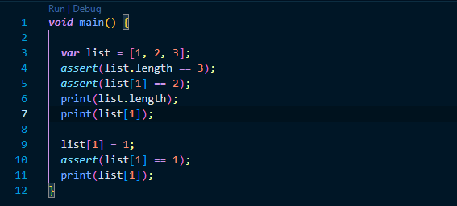

#### Langkah 2:
Silakan coba eksekusi (Run) kode pada langkah 1 tersebut. Apa yang terjadi? Jelaskan!

Output:
> 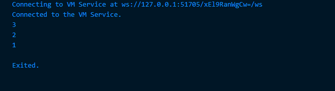
Tidak terjadi error dan program menampilkan 3 (panjang list) dan 2 (nilai elemen kedua sebelum diubah). Setelah diubah, menampilkan 1 (nilai elemen kedua setelah diubah). 

#### Langkah 3:
Ubah kode pada langkah 1 menjadi variabel final yang mempunyai index = 5 dengan default value = null. Isilah nama dan NIM Anda pada elemen index ke-1 dan ke-2. Lalu print dan capture hasilnya.

Apa yang terjadi ? Jika terjadi error, silakan perbaiki.

Hasil Praktikum:
> 

Output:
> 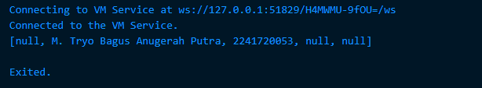

### Praktikum 2: Eksperimen Tipe Data Set

#### Langkah 1:
Ketik atau salin kode program berikut ke dalam fungsi `main()`.
```dart
var halogens = {'fluorine', 'chlorine', 'bromine', 'iodine', 'astatine'};
print(halogens);
```

Hasil Praktikum:
> 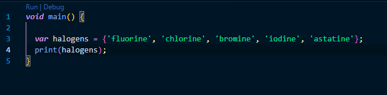

#### Langkah 2:
Silakan coba eksekusi (Run) kode pada langkah 1 tersebut. Apa yang terjadi? Jelaskan! Lalu perbaiki jika terjadi error.

Output:
> 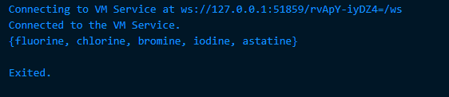
Tidak terjadi error. pada awal program mendeklarasikan sebuah set berisi elemen-elemen kimia halogen. Kemudian mencetak set `halogens`.

#### Langkah 3:
Tambahkan kode program berikut, lalu coba eksekusi (Run) kode Anda.
```dart
var names1 = <String>{};
Set<String> names2 = {}; // This works, too.
var names3 = {}; // Creates a map, not a set.

print(names1);
print(names2);
print(names3);
```

Apa yang terjadi ? Jika terjadi error, silakan perbaiki namun tetap menggunakan ketiga variabel tersebut. Tambahkan elemen nama dan NIM Anda pada kedua variabel Set tersebut dengan dua fungsi berbeda yaitu .add() dan .addAll(). Untuk variabel Map dihapus, nanti kita coba di praktikum selanjutnya.

Hasil Praktikum:
> 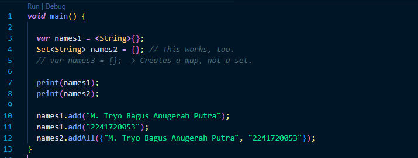

Output:
> 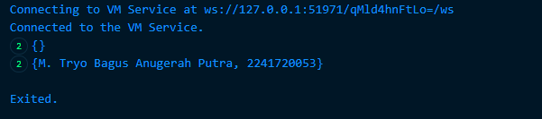

### Praktikum 3: Eksperimen Tipe Data Maps

#### Langkah 1:
Ketik atau salin kode program berikut ke dalam fungsi `main()`.
```dart
var gifts = {
  // Key:    Value
  'first': 'partridge',
  'second': 'turtledoves',
  'fifth': 1
};

var nobleGases = {
  2: 'helium',
  10: 'neon',
  18: 2,
};

print(gifts);
print(nobleGases);
```

Hasil Praktikum:
> 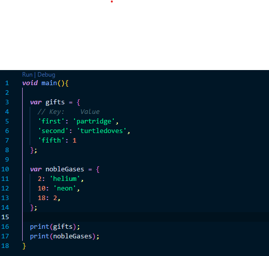

#### Langkah 2:
Silakan coba eksekusi (Run) kode pada langkah 1 tersebut. Apa yang terjadi? Jelaskan! Lalu perbaiki jika terjadi error.

Output:
> 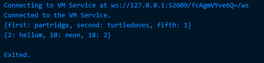
Tidak terjadi error. Kode tersebut mendeklarasikan Map dengan nama `gifts` yang menyimpan 3 pasangan key-value dengan key bertipe `String`. Kemudian juga mendeklarasikan Map `nobleGases` yang menyimpan 3 pasanganan key-value juga namun dengan key bertipe `int`. Kemudian program mencetak isi dari kedua Map.

#### Langkah 3:
Tambahkan kode program berikut, lalu coba eksekusi (Run) kode Anda.
```dart
var mhs1 = Map<String, String>();
gifts['first'] = 'partridge';
gifts['second'] = 'turtledoves';
gifts['fifth'] = 'golden rings';

var mhs2 = Map<int, String>();
nobleGases[2] = 'helium';
nobleGases[10] = 'neon';
nobleGases[18] = 'argon';
```

Apa yang terjadi ? Jika terjadi error, silakan perbaiki.

Hasil Praktikum:
> 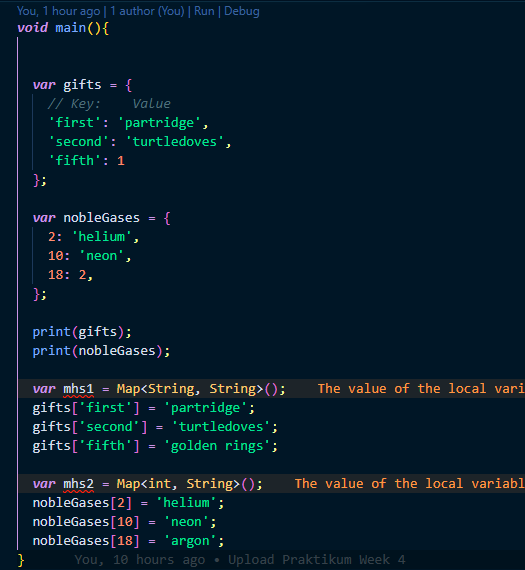

Output:
> 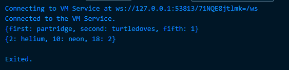
Tidak terjadi error dan berhasil mencetak isi dari Map `gifts` dan `nobleGases`.

Tambahkan elemen nama dan NIM Anda pada tiap variabel di atas (gifts, nobleGases, mhs1, dan mhs2). Dokumentasikan hasilnya dan buat laporannya!

Hasil Praktikum:
> 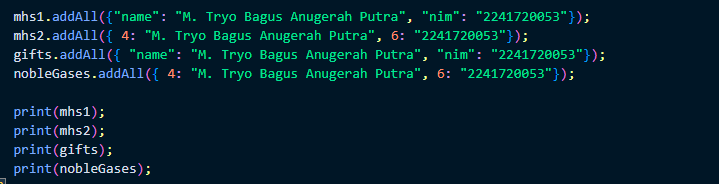

Output:
> 

### Praktikum 4: Eksperimen Tipe Data List: Spread dan Control-flow Operators

#### Langkah 1:
Ketik atau salin kode program berikut ke dalam fungsi `main()`.
```dart
var list = [1, 2, 3];
var list2 = [0, ...list];
print(list1);
print(list2);
print(list2.length);
```
Hasil Praktikum:
> 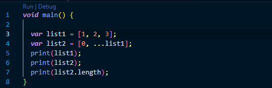

#### Langkah 2:
Silakan coba eksekusi (Run) kode pada langkah 1 tersebut. Apa yang terjadi? Jelaskan! Lalu perbaiki jika terjadi error.

Output:
> 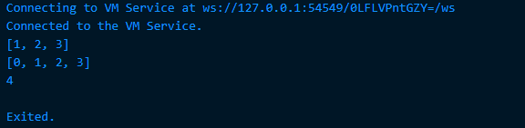

#### Langkah 3:
Tambahkan kode program berikut, lalu coba eksekusi (Run) kode Anda.
```dart
list1 = [1, 2, null];
print(list1);
var list3 = [0, ...?list1];
print(list3.length);
```
Apa yang terjadi ? Jika terjadi error, silakan perbaiki.

Output:
> 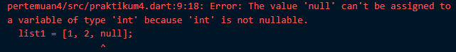
Terjadi error karena tidak memasukkan null pada tipe data `int`.

Perbaikan:
> 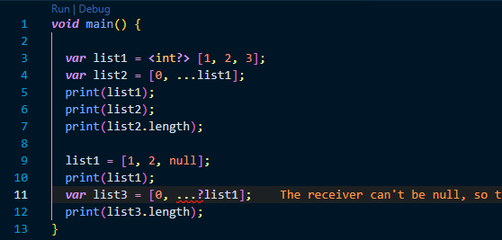

Output setelah diperbaiki:
> 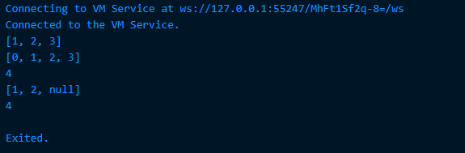

Tambahkan variabel list berisi NIM Anda menggunakan Spread Operators. Dokumentasikan hasilnya dan buat laporannya!

Hasil Penambahan:
> 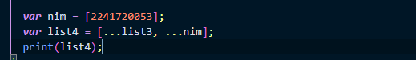

Output: 
> 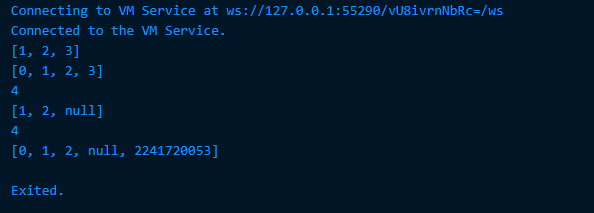

#### Langkah 4:
Tambahkan kode program berikut, lalu coba eksekusi (Run) kode Anda.
```dart
var nav = ['Home', 'Furniture', 'Plants', if (promoActive) 'Outlet'];
print(nav);
```
Apa yang terjadi ? Jika terjadi error, silakan perbaiki. Tunjukkan hasilnya jika variabel `promoActive` ketika `true` dan `false`.

Kode ketika `promoActive` bernilai `true`:
> 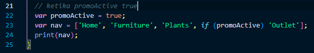

Output:
> 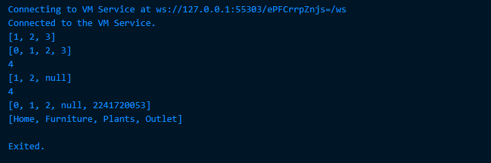

Kode ketika `promoActive` bernilai `false`:
> 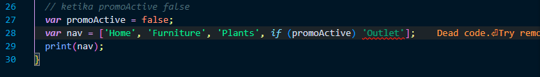

Output:
> 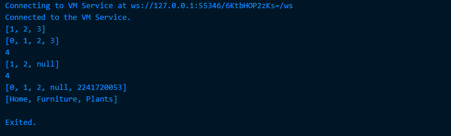

#### Langkah 5:
Tambahkan kode program berikut, lalu coba eksekusi (Run) kode Anda.
```dart
var nav2 = ['Home', 'Furniture', 'Plants', if (login case 'Manager') 'Inventory'];
print(nav2);
```
Apa yang terjadi ? Jika terjadi error, silakan perbaiki. Tunjukkan hasilnya jika variabel `login` mempunyai kondisi lain.

Hasil Penambahan:
> 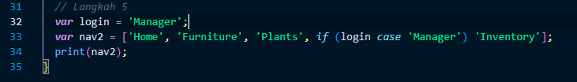

Output:
> 

Penambahan kode dengan var `login` memiliki kondisi lain:
> 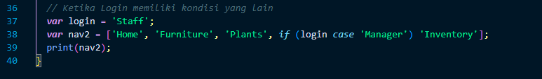

Output:
> 

#### Langkah 6:
Tambahkan kode program berikut, lalu coba eksekusi (Run) kode Anda.
```dart
var listOfInts = [1, 2, 3];
var listOfStrings = ['#0', for (var i in listOfInts) '#$i'];
assert(listOfStrings[1] == '#1');
print(listOfStrings);
```
Apa yang terjadi ? Jika terjadi error, silakan perbaiki. Jelaskan manfaat Collection For dan dokumentasikan hasilnya.

Hasil Penambahan:
> 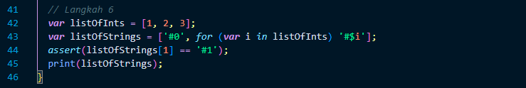

Output:
> 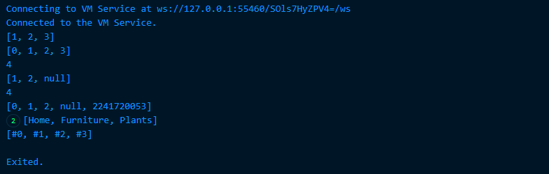
Tidak terjadi error dan program akan menampilkan seperti diatas. Collection For adalah fitur yang memungkinkan Anda menghasilkan list, set, atau map dengan cara yang lebih efisien dan ekspresif menggunakan loop `for`. Dalam kode ini, Collection For digunakan untuk menambahkan string `#i` ke dalam `listOfStrings` untuk setiap elemen `i` di `listOfInts`.


### Praktikum 5: Eksperimen Tipe Data Records

#### Langkah 1:
Ketik atau salin kode program berikut ke dalam fungsi `main()`.
```dart
var record = ('first', a: 2, b: true, 'last');
print(record)
```

Hasil Praktikum:
> 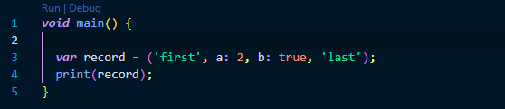

#### Langkah 2:
Silakan coba eksekusi (Run) kode pada langkah 1 tersebut. Apa yang terjadi? Jelaskan! Lalu perbaiki jika terjadi error.

Output:
> 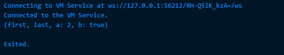
Tidak terjadi error. program menampilkan hasil seperti diatas dimana merupakan data yang telah dimasukkan pada record.


#### Langkah 3:
Tambahkan kode program berikut di luar scope void main(), lalu coba eksekusi (Run) kode Anda.
```dart
(int, int) tukar((int, int) record) {
  var (a, b) = record;
  return (b, a);
}
```
Apa yang terjadi ? Jika terjadi error, silakan perbaiki. Gunakan fungsi tukar() di dalam main() sehingga tampak jelas proses pertukaran value field di dalam Records.

Hasil Praktikum:
> 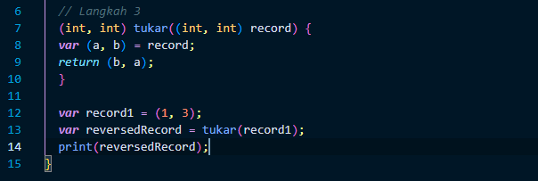

Output:
> 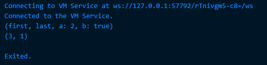
Fungsi `tukar` ini adalah sebuah cara sederhana untuk menukar dua angka.

#### Langkah 4:
Tambahkan kode program berikut di dalam scope void main(), lalu coba eksekusi (Run) kode Anda.
```dart
// Record type annotation in a variable declaration:
(String, int) mahasiswa;
print(mahasiswa);
```
Apa yang terjadi ? Jika terjadi error, silakan perbaiki. Inisialisasi field nama dan NIM Anda pada variabel record mahasiswa di atas. Dokumentasikan hasilnya dan buat laporannya!

Jawab:

Terjadi error karena non-nullable variable harus di inisialisasi terlebih dahulu sebelum digunakan, maka berikut adalah perbaikan dalam implemantasi kode diatas:
> 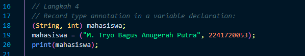

Output:
> 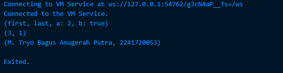

#### Langkah 5:
Tambahkan kode program berikut di dalam scope void main(), lalu coba eksekusi (Run) kode Anda.
```dart
var mahasiswa2 = ('first', a: 2, b: true, 'last');

print(mahasiswa2.$1); // Prints 'first'
print(mahasiswa2.a); // Prints 2
print(mahasiswa2.b); // Prints true
print(mahasiswa2.$2); // Prints 'last'
```
Apa yang terjadi ? Jika terjadi error, silakan perbaiki. Gantilah salah satu isi record dengan nama dan NIM Anda, lalu dokumentasikan hasilnya dan buat laporannya!

Output:
> 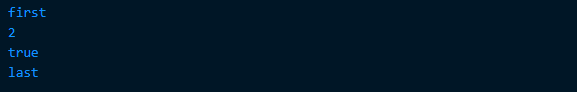
Tidak terjadi error dan program menampilkan seperti diatas.

Untuk mengganti salah satu nilai dalam record, kita perlu mendeklarasikan ulang variabel tersebut dengan record yang baru. Hal ini disebabkan karena record bersifat immutable, artinya nilainya tidak bisa diubah setelah dibuat. Oleh karena itu, solusi yang tepat adalah mendeklarasikan ulang record dengan nilai yang diinginkan.

```dart
mahasiswa2 = (mahasiswa2.$1, a: mahasiswa2.a, b: mahasiswa2.b, "M. Tryo Bagus Anugerah Putra");

print(mahasiswa2);
```

Output:
> [Output-Praktikum-5-Langkah-5-1](docs/outputP5L5-1.png)
