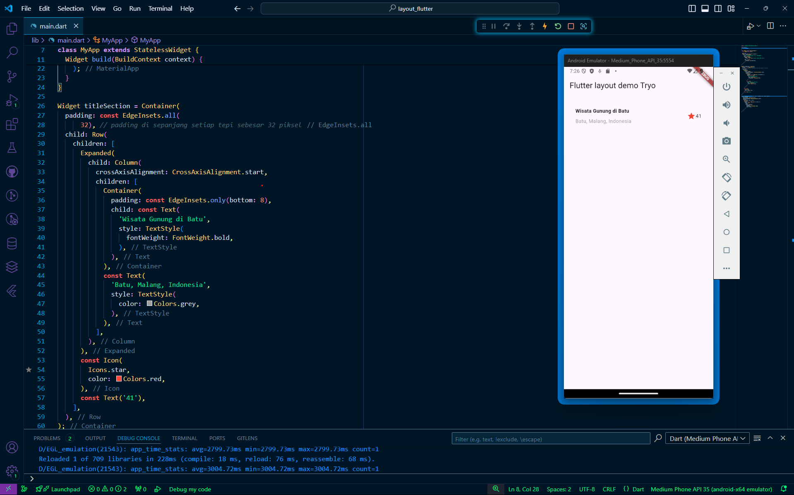
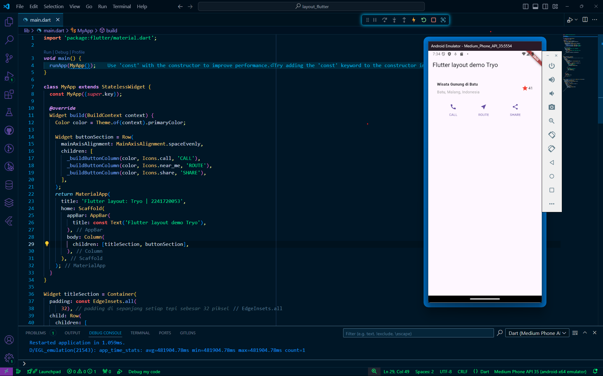
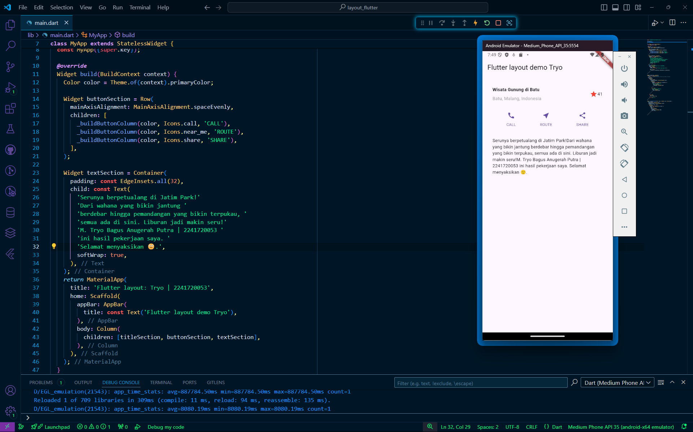
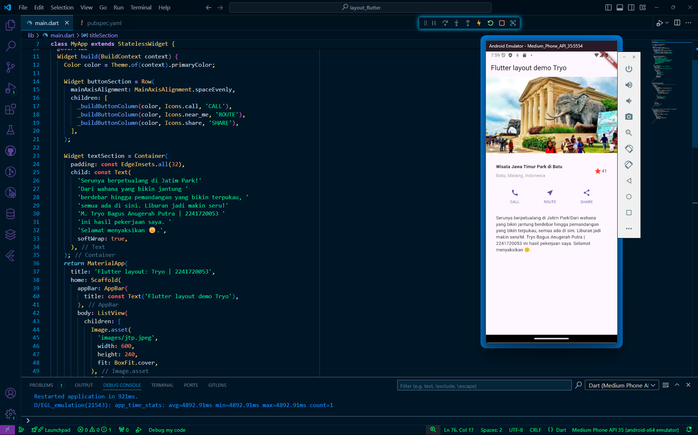
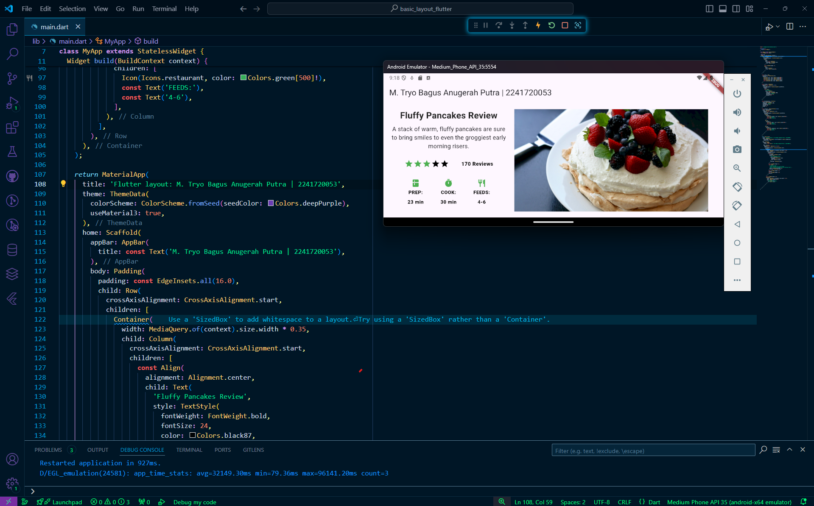
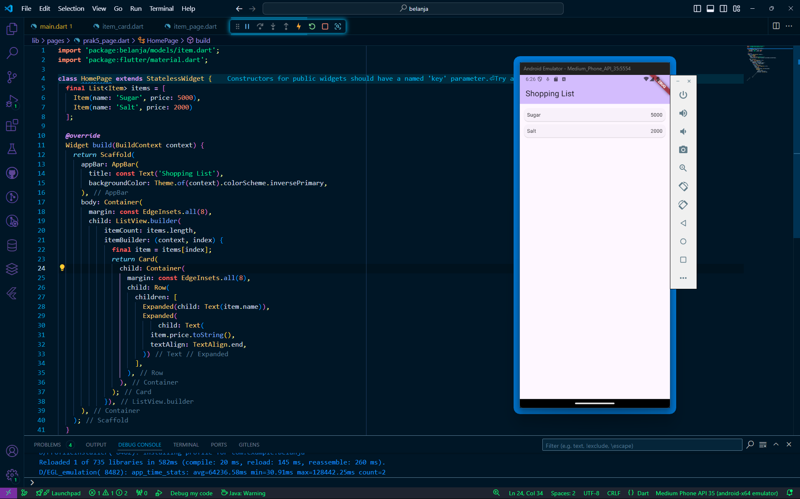
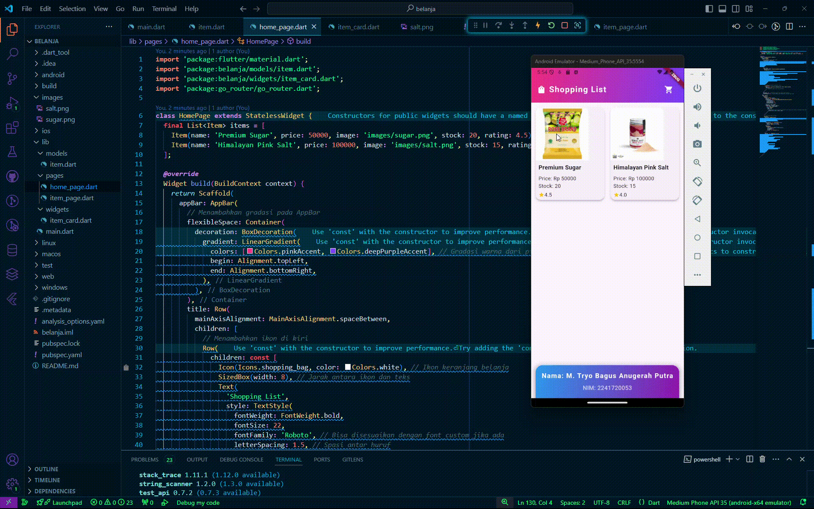

# Praktikum Pemrograman Mobile Minggu 6

> Nama : M. Tryo Bagus Anugerah  
> NIM: 2241720053 
> Kelas : TI-3H  
> Absen : 14  

## Praktikum 1: Membangun Layout di Flutter

>

## Praktikum 2: Implementasi Button Row

>

## Praktikum 3: Implementasi Text Section

>

## Praktikum 4: Implementasi Image Section

>

## Tugas Praktikum 1

>

## Praktikum 5: Membangun Navigasi di Flutter

>

## Tugas Praktikum 2

>
