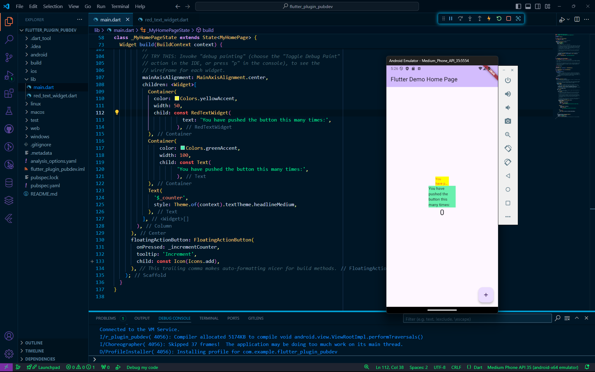

# Praktikum Pemrograman Mobile Minggu 7

> Nama : M. Tryo Bagus Anugerah <br />
> NIM: 2241720053<br />
> Kelas : TI-3H <br />
> Absen : 14 <br />

<hr>

## Praktikum Menerapkan Plugin di Project Flutter

> 

## Tugas Praktikum

1. Selesaikan Praktikum tersebut, lalu dokumentasikan dan push ke repository Anda berupa screenshot hasil pekerjaan beserta penjelasannya di file README.md!
2. Jelaskan maksud dari langkah 2 pada praktikum tersebut!
    > Jawab : Pada langkah 2 merupakan proses menambahkan plugin pada dependency project Flutter. langkah tersebut dapat dilakukan dengan menggunakan perintah dari flutter yaitu

    ```bash
    flutter pub add <plugin_name>
    ```

    > Seperti yang dilakukan pada praktikum langkah 2 sebelumnya yaitu menambahkan plugin auto_size_text` sehingga perintah menjadi seperti berikut

    ```bash
    flutter pub add auto_size_text
    ```

    > Ketika perintah tersebut dijalankan, maka flutter akan menambahkan dependency pada `pubspec.yaml`
3. Jelaskan maksud dari langkah 5 pada praktikum tersebut!
    > Jawab : Pada langkah 5 bertujuan untuk mendefinisikan attribute baru yaitu text, Kemudian menjadikan nya sebagai parameter yang wajib diisi pada constructor widget RedTextWidget
4. Pada langkah 6 terdapat dua widget yang ditambahkan, jelaskan fungsi dan perbedaannya!
    > Pada langkah 6 ditambahkan dua widget, yaitu `Container` yang berisi widget `Text` dan `RedTextWidget`. `RedTextWidget` terdiri dari widget `AutoSizeText`, yang memiliki keunggulan dibandingkan `Text` biasa. Dengan menggunakan `AutoSizeText`, ukuran teks dapat menyesuaikan secara otomatis agar sesuai dengan ruang yang tersedia. Sementara itu, widget `Text` biasa tidak memiliki kemampuan untuk menyesuaikan ukuran teks terhadap ruang di dalam widget pembungkusnya.
5. Jelaskan maksud dari tiap parameter yang ada di dalam plugin auto_size_text berdasarkan tautan pada dokumentasi ini (https://pub.dev/documentation/auto_size_text/latest/)!
    > Berdasarkan dokumentasi terdapat beberapa parameter yang dapat digunakan pada widget `AutoSizeText`, antara lain:

    | Parameters          | Penjelasan                                                                                                                                                    |
    |---------------------|---------------------------------------------------------------------------------------------------------------------------------------------------------------|
    | key                 | Digunakan untuk mengidentifikasi widget secara unik dan mengontrol bagaimana widget diganti dalam hirarki aplikasi.                                           |
    | textKey             | Kunci khusus untuk widget teks di dalam AutoSizeText, memberikan kontrol lebih pada widget teks internal.                                                     |
    | style               | Mengatur gaya teks seperti warna, ukuran font, dan ketebalan font. Jika tidak diisi, gaya default akan digunakan.                                             |
    | minFontSize         | Ukuran font terkecil yang bisa digunakan saat ukuran teks menyesuaikan secara otomatis.                                                                       |
    | maxFontSize         | Ukuran font terbesar yang bisa digunakan saat ukuran teks menyesuaikan secara otomatis.                                                                       |
    | stepGranularity     | Menentukan seberapa besar langkah perubahan ukuran font saat menyesuaikan teks.                                                                               |
    | presetFontSizes     | Daftar ukuran font yang sudah ditentukan sebelumnya, diurutkan dari terbesar ke terkecil. Ini menggantikan minFontSize dan maxFontSize.                       |
    | group               | Menyinkronkan ukuran teks dari beberapa AutoSizeText agar memiliki ukuran yang sama di semua widget dalam grup.                                               |
    | textAlign           | Menentukan perataan horizontal teks, seperti kiri, tengah, atau kanan.                                                                                        |
    | textDirection       | Menentukan arah teks, apakah dari kiri ke kanan atau kanan ke kiri. Ini mempengaruhi cara perataan teks seperti TextAlign.start dan TextAlign.end diterapkan. |
    | locale              | Menentukan bahasa dan format teks berdasarkan wilayah, penting untuk merender karakter Unicode yang berbeda.                                                  |
    | softWrap            | Menentukan apakah teks akan dipisahkan di titik-titik istirahat lembut (misalnya setelah spasi) untuk membuat baris baru.                                     |
    | wrapWords           | Mengatur apakah kata-kata yang tidak muat dalam satu baris akan dipindahkan ke baris berikutnya.                                                              |
    | overflow            | Menentukan bagaimana menangani teks yang terlalu panjang, seperti memotong teks atau menampilkan tanda elipsis (...).                                         |
    | overflowReplacement | Widget pengganti yang akan ditampilkan jika teks melebihi batas dan tidak bisa ditampilkan seluruhnya.                                                        |
    | textScaleFactor     | Menentukan seberapa besar ukuran font secara relatif terhadap ukuran logis standar, sehingga mempengaruhi ukuran teks secara keseluruhan.                     |
    | maxLines            | Menentukan jumlah baris maksimum yang bisa ditampilkan oleh teks. Jika melebihi, teks akan disesuaikan sesuai pengaturan overflow.                            |
    | semanticsLabel      | Label alternatif untuk teks, digunakan untuk keperluan aksesibilitas seperti pembaca layar.                                                                   |